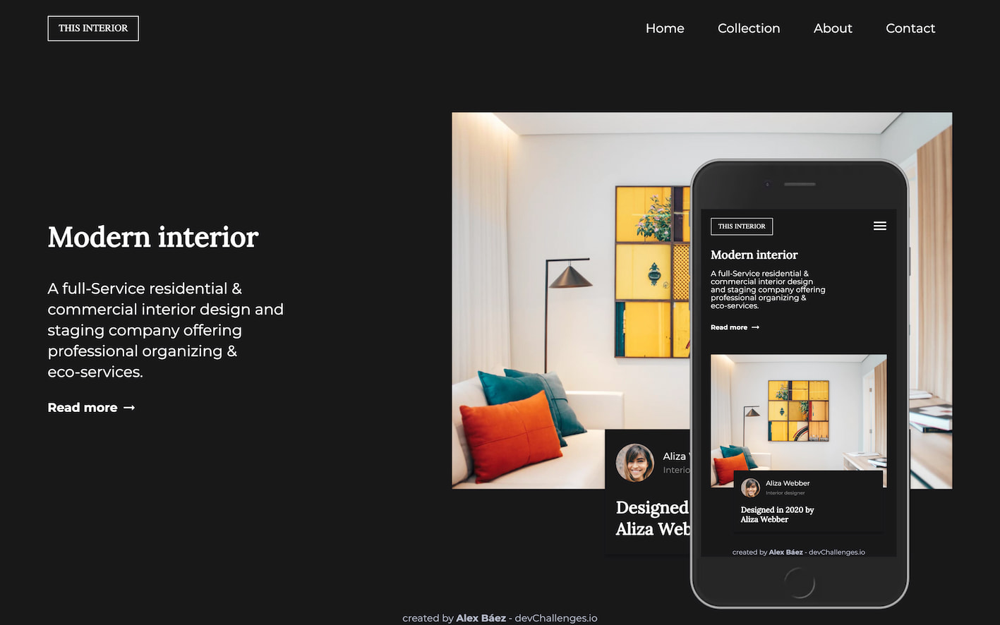

<h1 align="center">Interior Consultant</h1>

   Solution for a challenge from  <a href="http://devchallenges.io" target="_blank">Devchallenges.io</a>.

  <h3>
    <a href="https://alexbaezd.github.io/interior-consultant/">
      Demo
    </a>
     | 
    <a href="https://github.com/alexbaezd/interior-consultant.git">
      Solution
    </a>
     | 
    <a href="https://devchallenges.io/challenges/Jymh2b2FyebRTUljkNcb">
      Challenge
    </a>
  </h3>

<!-- TABLE OF CONTENTS -->

## Table of Contents

- [Overview](#overview)
  - [Built With](#built-with)
- [Features](#features)
- [Contact](#contact)
- [Acknowledgements](#acknowledgements)

<!-- OVERVIEW -->

## Overview

### Built With

- HTML
- CSS
- JavaScript

## Features

- Mobile First
- CSS GRID

This application/site was created as a submission to a [DevChallenges](https://devchallenges.io/challenges) challenge. The [challenge](https://devchallenges.io/challenges/Jymh2b2FyebRTUljkNcb) was to build an application to complete the given user stories.

## Acknowledgements

- [Simplified Fluid Typography](https://css-tricks.com/simplified-fluid-typography/)

## Contact

- Website [alexbaez.dev](https://alexbaez.dev)
- GitHub [@alexbaezd](https://github.com/alexbaezd)
